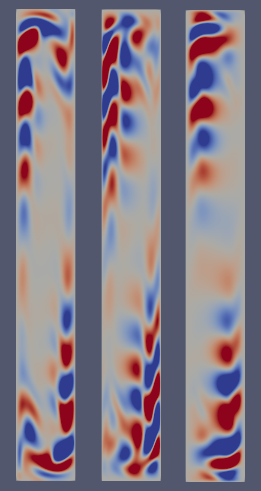

# Repository for stability analysis of some fluid flows

script zucatti.py: this is an attempt at implementing perturbation analysis of convective flows as in *Assessment of reduced-order modeling strategies for convective heat transfer*, V. Zucatti et al.

In that paper it's shown that there are interesting harmonic perturbations for Rayleigh number $Ra = 3.4 \times 10^5$, shown here by modelling the same system using the *Nektar++* spectral / hp element code.

The question is why the Firedrake perturbation analysis does not find an unstable or oscillatory eigenmode in the neighbourhood of $Ra = 3.4 \times 10^5$.  

A very similar script (farrell.py) was used to find a bifurcation instability in the heated-from-below Rayleigh-Benard convection case, with results agreeing with the analysis in Section IV.A of the paper *Bifurcation analysis of two-dimensional Rayleigh-Benard convection using deflation* by Boulle, Dallas, and Farrell.  Note this is not quite the same type of instability (bifurcation not turbulent transition).

